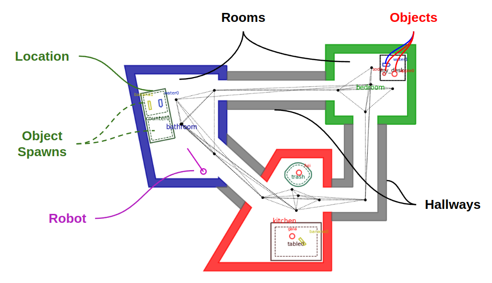
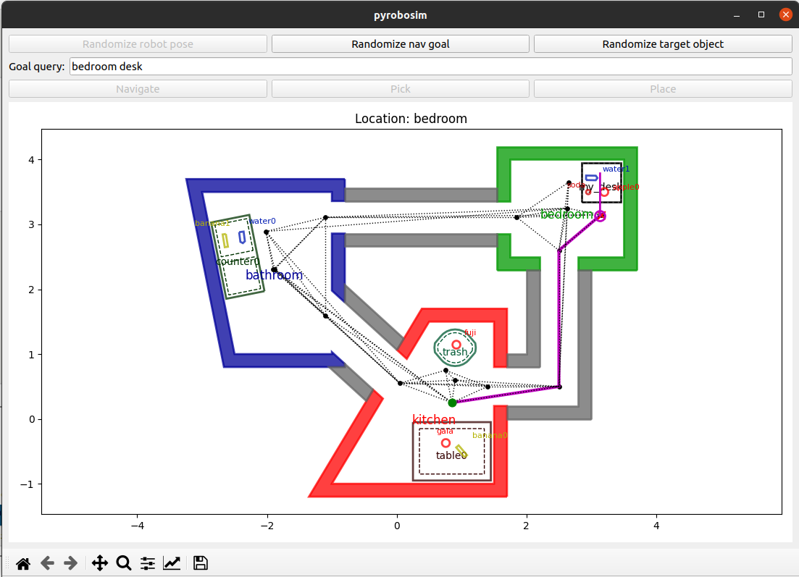

Concepts
========

PyRoboSim is primarily a world modeling framework for prototyping high-level robotics behavior applications.

Worlds
------

Worlds in PyRoboSim consist of a hierarchy of polygonal *entities*, including:

* **Robots**: A movable entity capable of actions that can change its own state and the state of the world.
* **Rooms**: Regions that a robot can navigate.
* **Hallways**: Regions connecting two rooms, which a robot can navigate, open, and close.
* **Locations**: Regions inside rooms that may contain objects (e.g., furniture or storage locations).
* **Object Spawns**: Subregions of locations where objects may exist (e.g., a left vs. right countertop).
* **Objects**: Discrete entities that can be manipulated around the world.

This is all represented in a 2.5D environment (SE(2) pose with vertical (Z) height).
However, full 3D poses are representable as well.
For more information, refer to the :ref:`geometry_conventions` section.

|

Actions
-------

Within the world, we can spawn a robot that can perform a set of *actions*, such as navigating, picking, and placing.
To learn more, refer to :ref:`robot_actions`.

These actions can be specified individually, or as a sequence of actions (a *plan*).
Actions or plans can be commanded directly, e.g., "go to the table and pick up an apple".
They can also come from a :ref:`task_and_motion_planning` framework that accepts a task specification (e.g., "all apples should be on the kitchen table") and outputs a plan that, when executed, satisfies the specification.

For example, here is a robot performing a **Navigate** action from the kitchen to the desk in our simple test world.

|
