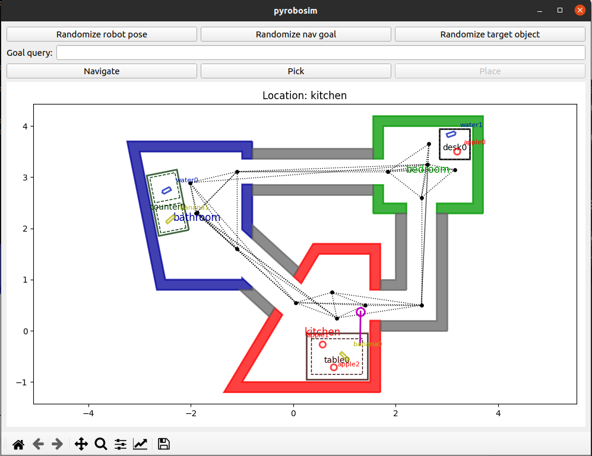
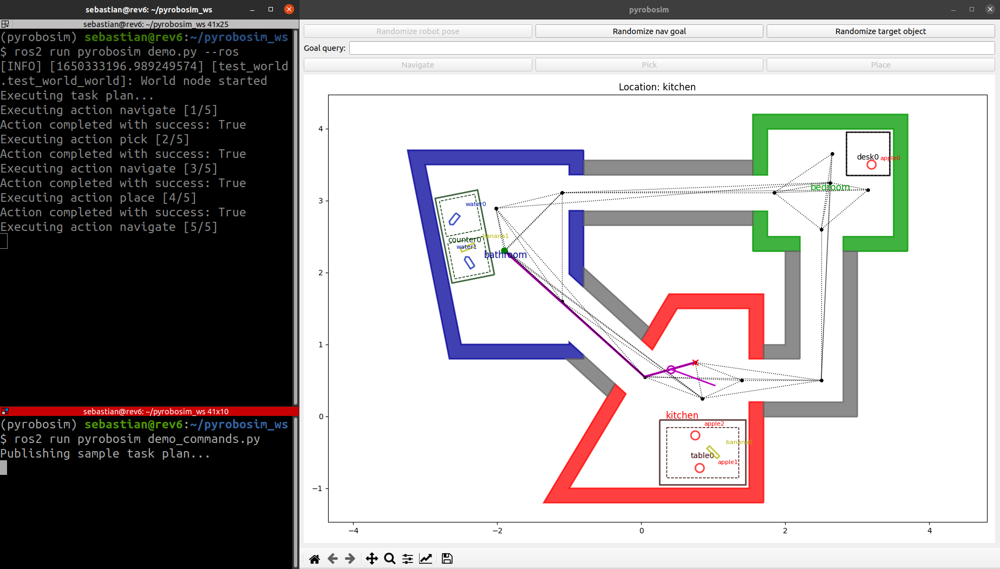
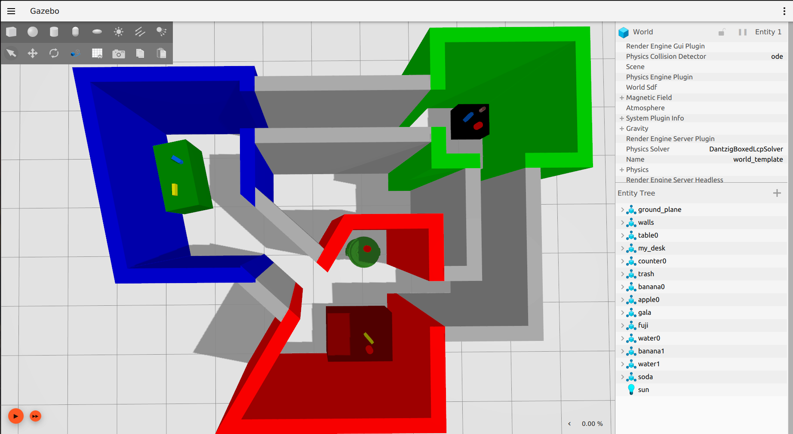
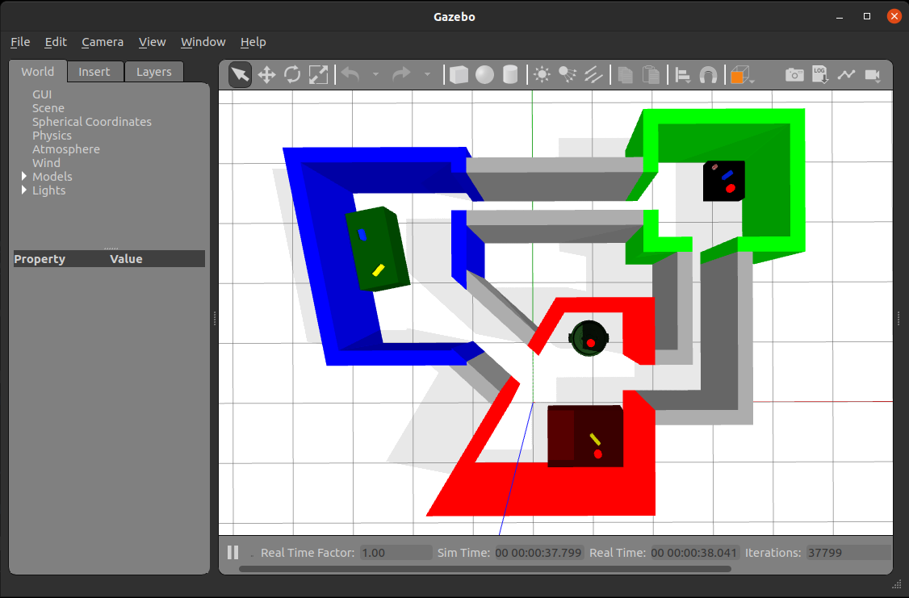

Basic Usage
===========
To get started with PyRoboSim, you can run the following examples.

Standalone
----------

First, go to the ``pyrobosim`` subfolder under the repository root.

::

    cd /path/to/pyrobosim/pyrobosim

Then, run the example.

::

    python3 examples/demo.py

You can now interact with the GUI through the buttons and text boxes.
For example, enter "bedroom desk" in the **Goal query** text box and then click the **Navigate** button.
Once at the destination, click **Pick**.

|

With ROS 2
----------

First, build and setup your ROS 2 workspace (or use one of our provided Docker containers).

::

    cd /path/to/ros_workspace
    colcon build
    . install/local_setup.bash

You can run a ROS 2 enabled demo and interact with the GUI:

::

    ros2 run pyrobosim_ros demo.py

In a separate Terminal, you can send an action goal with a task plan or a single action:

::

    ros2 run pyrobosim_ros demo_commands.py --ros-args -p mode:=action
    ros2 run pyrobosim_ros demo_commands.py --ros-args -p mode:=plan

Or, you can run both of these nodes together using a provided launch file:

::

    ros2 launch pyrobosim_ros demo_commands.launch.py mode:=plan
    ros2 launch pyrobosim_ros demo_commands.launch.py mode:=action

The first command will start a world as a ROS 2 node, and the second one will execute a plan (or set of actions) to the node.

|

Creating Worlds
---------------

Worlds can be created either with the Python API, or loaded from a YAML file using the :py:class:`pyrobosim.core.yaml_utils.WorldYamlLoader` utility.

By default, ``demo.py`` creates a world using the API, but you can alternatively try a demo YAML file using the ``--world-file`` argument.
For example:

::

    # Standalone
    python3 examples/demo.py --world-file test_world.yaml

    # ROS 2
    ros2 launch pyrobosim_ros demo.launch.py world_file:=test_world.yaml

Refer to the :ref:`yaml_schemas` documentation for more information.

Exporting Worlds to Gazebo
--------------------------

To export worlds to Gazebo, there is a :py:class:`pyrobosim.core.gazebo.WorldGazeboExporter` utility.
You can try this with the following commands.

::

    # Standalone
    python3 examples/demo_world_save.py

    # ROS 2
    ros2 run pyrobosim_ros demo_world_save.py

Then, follow the steps displayed on the console to see the generated world.

If you add the ``--classic`` flag to this demo, you can similarly export to Gazebo Classic.

::

    # Standalone
    python3 examples/demo_world_save.py --classic

    # ROS 2
    ros2 run pyrobosim_ros demo_world_save.py --classic

|
