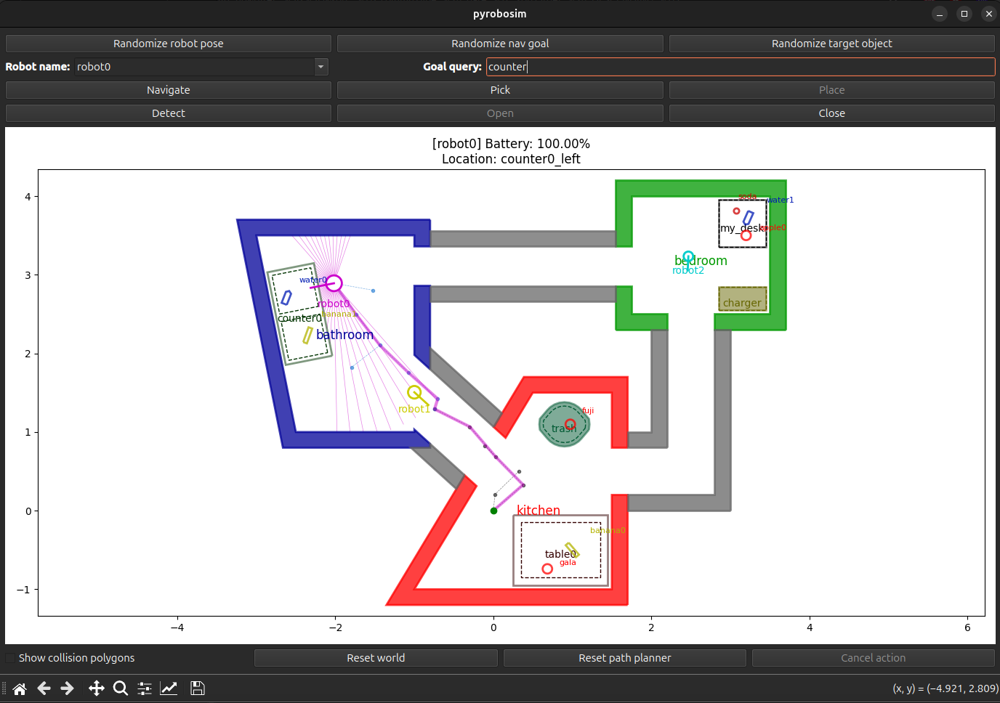

Basic Usage
===========
To get started with pyrobosim, you can run the following examples.

Standalone
----------

First, install the module.

::

    cd /path/to/pyrobosim/pyrobosim
    pip install .

Then, run the test script.

::

    python examples/demo.py

You can now interact with the GUI through the buttons and text boxes.
For example, enter "bedroom desk" in the **Goal query** text box and then
click the **Navigate** button. Once at the destination, click **Pick**.

|

With ROS2
---------

First, build and setup the ``colcon`` workspace (or use one of our provided Docker containers).

::

    colcon build
    . install/local_setup.bash

You can run a ROS2 enabled demo and interact with the GUI:

::

    ros2 run pyrobosim_ros demo.py 

In a separate Terminal, you can publish a list of commands as follows:

::

    ros2 run pyrobosim_ros demo_commands.py

The first command will start a world as a ROS2 node, and the second one will publish a plan (or set of actions) to the node.

.. image:: ../media/pyrobosim_demo_ros.png
    :align: center
    :width: 600px
    :alt: Basic ROS2 demo.

|

Creating Worlds
---------------
Worlds can be created either with the pyrobosim API, or loaded from a YAML file using the :doc:`WorldYamlLoader </generated/pyrobosim.core.yaml.WorldYamlLoader>` utility:

By default, ``demo.py`` creates a world using the API, but you can alternative try a demo YAML file using the ``--from-file`` argument. For example:

::

    python examples/demo.py --from-file
    ros2 run pyrobosim_ros demo.py --from-file

Refer to the :doc:`YAML Schemas </yaml/index>` documentation for more information.

Exporting Worlds to Gazebo
--------------------------
To export worlds to Gazebo, there is a :doc:`WorldGazeboExporter </generated/pyrobosim.core.gazebo.WorldGazeboExporter>` utility:

Standalone:

::

    python examples/demo_world_save.py

ROS:

::

    ros2 run pyrobosim_ros demo_world_save.py

You can then follow the steps to see the generated world.

If you add the ``--ignition`` flag to this demo, you can similarly export to Ignition Gazebo!

::

    ros2 run pyrobosim_ros demo_world_save.py --ignition

.. image:: ../media/ignition_demo_world.png
    :align: center
    :width: 600px
    :alt: Example world exported to Ignition Gazebo.

|
