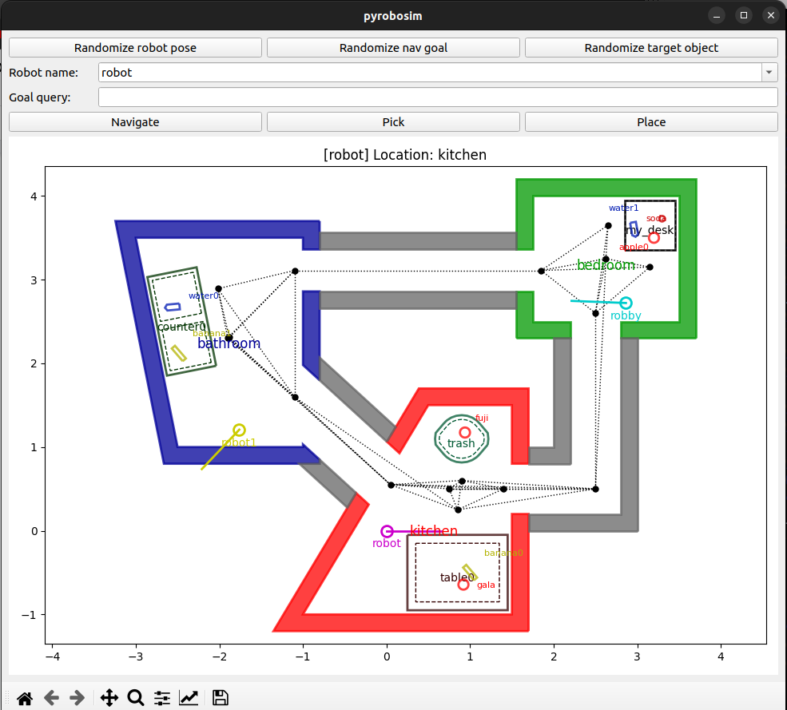
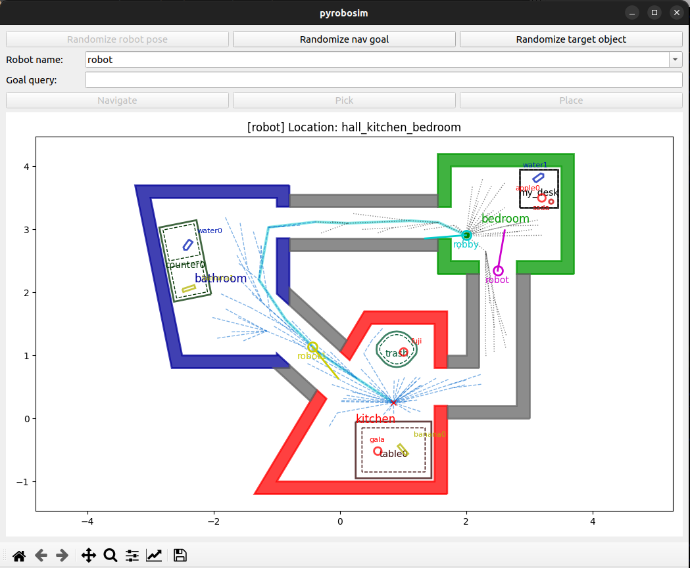

Multirobot Environments
=======================

PyRoboSim enables you to run multirobot environments.

Standalone
----------

To run a multirobot world, you can try this example:

::

    cd /path/to/pyrobosim/pyrobosim
    python3 examples/demo.py --multirobot

Or you can use a sample multirobot world file:

::

    cd /path/to/pyrobosim/pyrobosim
    python3 examples/demo.py --world-file test_world_multirobot.yaml

|

With ROS 2
----------

First, build and setup your ROS 2 workspace (or use one of our provided Docker containers).

::

    cd /path/to/ros_workspace
    colcon build
    . install/local_setup.bash

You can run a ROS 2 enabled multirobot demo and interact with the GUI:

::

    ros2 run pyrobosim_ros demo.py --ros-args -p world_file:=test_world_multirobot.yaml

In a separate Terminal, you can send an action goal with a multirobot plan:

::

    ros2 run pyrobosim_ros demo_commands.py --ros-args -p mode:=multirobot-plan

Alternatively, you can run a single launch file:

::

    ros2 launch pyrobosim_ros demo_commands_multirobot.launch.py

The output should look as follows:

|
