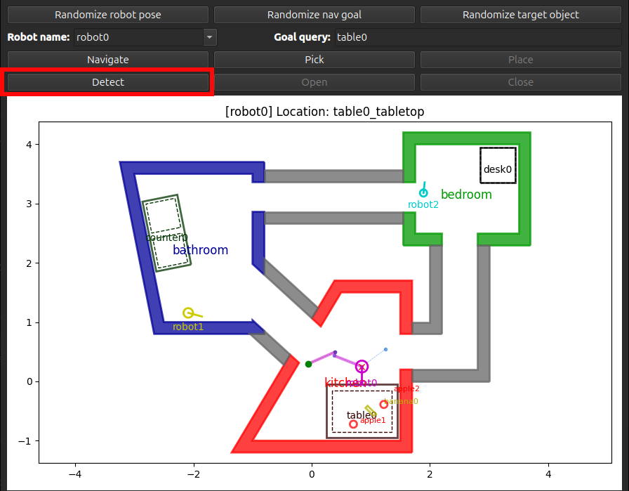

.. _robot_actions:

Robot Actions
=============

PyRoboSim enables you to command robots to take high-level actions.

The actions currently supported are:

* **Navigate**: Uses a path planner to navigate to a specific location. Refer to :ref:`path_planners` for more details.
* **Pick**: Picks up an object at the robot's current location.
* **Place**: Places an object at the robot's current location.
* **Detect**: Detects objects at the robot's current location. Refer to :ref:`partial_observability` for more details.
* **Open**: Opens the robot's current location.
* **Close**: Closes the robot's current location.

Executing Actions and Plans
---------------------------

Actions can be executed in a few ways:

* Through the buttons on the GUI.
* Using a robot's :py:meth:`pyrobosim.core.robot.Robot.execute_action` method.
* (If using ROS), sending a goal to the ``/execute_action`` ROS action server.

For example, a default action execution code block may look like this:

.. code-block:: python

    from pyrobosim.planning.actions import TaskAction

    action = TaskAction(
        "navigate",
        source_location="kitchen",
        target_location="my_desk",
    )
    robot.execute_action(action)

You can also command a robot with a *plan*, which is a sequences of actions:

* Using a robot's :py:meth:`pyrobosim.core.robot.Robot.execute_plan` method.
* (If using ROS), sending a goal to the ``/execute_task_plan`` ROS action server.

.. code-block:: python

    from pyrobosim.planning.actions import TaskAction, TaskPlan

    actions = [
        TaskAction(
            "navigate",
            source_location="kitchen",
            target_location="my_desk",
        ),
        TaskAction("detect", object="apple"),
        TaskAction("pick", object="apple"),
        TaskAction("place", object="apple"),
        TaskAction(
            "navigate",
            source_location="my_desk",
            target_location="hall_kitchen_bedroom",
        ),
        TaskAction("close", target_location="hall_kitchen_bedroom"),
        TaskAction("open", target_location="hall_kitchen_bedroom"),
    ]
    plan = TaskPlan(actions=actions)
    result, num_completed = robot.execute_plan(plan)

Plans can also be automatically generated with :ref:`task_and_motion_planning`.

Both actions and plans return an :py:class:`pyrobosim.planning.actions.ExecutionResult` object that contains:

* An :py:class:`pyrobosim.planning.actions.ExecutionStatus` enumeration containing common status such as ``SUCCESS``, ``PLANNING_FAILURE``, and ``EXECUTION_FAILURE``.
* An optional string describing the result.

You can cancel actions and plans that are executing on a robot using its :py:meth:`pyrobosim.core.robot.Robot.cancel_actions` method.

The ROS 2 interface also supports sending and canceling actions and plans, with the ``pyrobosim_msgs.action.ExecuteTaskAction`` and ``pyrobosim.action.ExecuteTaskPlan`` actions, respectively.
You can try it out with the following example.

::

    ros2 launch pyrobosim_ros demo_commands.launch.py mode:=action send_cancel:=false
    ros2 launch pyrobosim_ros demo_commands.launch.py mode:=plan send_cancel:=false

Similarly to the Python API, these ROS 2 action definitions embed their status in a message field of type ``pyrobosim_msgs.msg.ExecutionResult``.

.. _simulating_action_execution:

Simulating Action Execution
---------------------------

By default, all robots can execute their actions perfectly.
However, actions can still fail due to planning errors or because they are infeasible (e.g, picking an object while holding another).

You can use the action's *execution options* to modify the behavior of your robot to simulate delays, failures, or battery consumption.
For example,

.. code-block:: python

    from pyrobosim.core import Robot
    from pyrobosim.planning.actions import ExecutionOptions, TaskAction

    robot = Robot(
        name="robot0",
        initial_battery_level=100.0,
        action_execution_options = {
            "navigate": ExecutionOptions(
                success_probability=0.5,
                rng_seed=1234,
                battery_usage=1.0,
            ),
            "pick": ExecutionOptions(
                delay=1.0,
                success_probability=0.75,
                battery_usage=5.0
            ),
        },
    )

    action = TaskAction(
        "navigate",
        source_location="kitchen",
        target_location="my_desk",
    )

    robot.execute_action(action)

Of particular interest is the ``rng_seed`` options which can be used to control determinism of simulated failures.
If you leave this option at its default value (``None``), the failures will be nondeterministic, but explicitly setting the seed can provide reproducible action failure results.

**NOTE:** You can also set these action execution options in the :ref:`YAML specification <yaml_schemas>` for your robot.

.. _partial_observability:

Partial Observability
---------------------

By default, all robots have full knowledge of all the entities in the world.

A common use case for design robot behaviors is that a robot instead starts with limited or no knowledge of objects.
In these cases, the robot must explicitly go to a location and use an object detector to find new objects to add to their world model.

You can model this in PyRoboSim by instantiating robot objects with the ``partial_obs_objects`` option set to ``True``.
Then, you can use the **Detect** action to find objects at the robot's current location.

To test this, you can run the following example.

::

    cd /path/to/pyrobosim/pyrobosim
    python3 examples/demo.py --multirobot --partial-obs-objects

In the GUI, selecting a robot in the drop-down menu will only display the objects locally known to that robot.
Alternatively, you can select the ``world`` option to show all existing objects.

|

Similarly, you can model partial observability of hallway states by instantiating robot objects with the ``partial_obs_hallways`` option set to ``True``.
In this case, the robot assumes all hallways are initially open.
If equipped with a lidar sensor, the robot can update its local knowledge of the hallway states when navigating within range.

To test this, you can run the following example.

::

    cd /path/to/pyrobosim/pyrobosim
    python3 examples/demo_partial_obs_hallways.py
