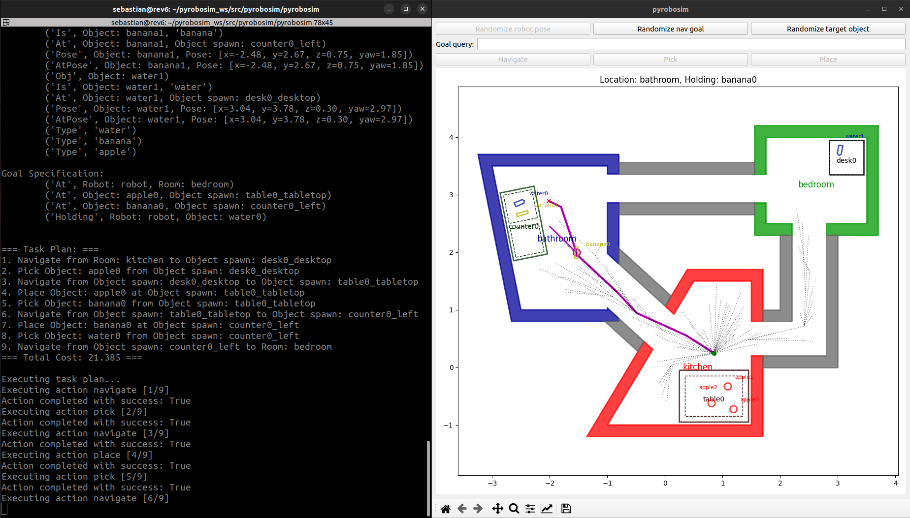
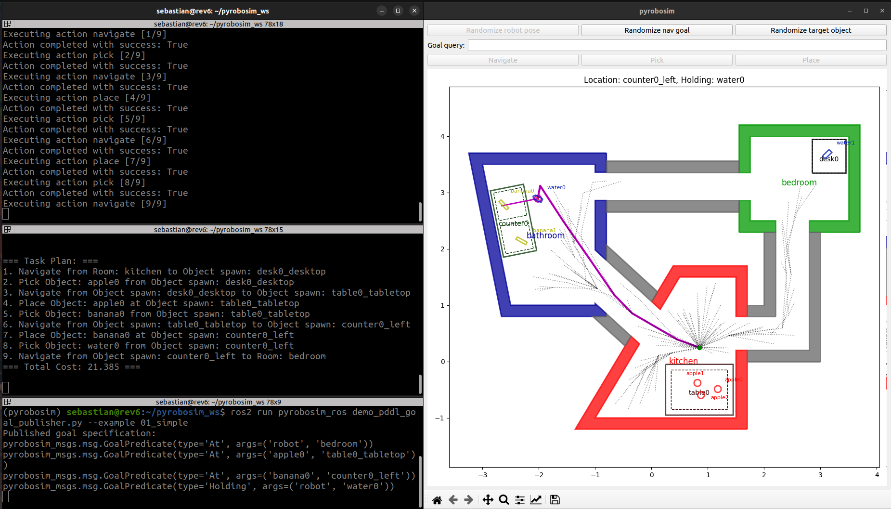

.. _task_and_motion_planning:

Task and Motion Planning
========================

We use `PDDLStream <https://github.com/caelan/pddlstream>`_ to perform integrated task and motion planning (TAMP).
This tool expands task planning with purely discrete parameters using `Planning Domain Definition Language (PDDL) <https://planning.wiki/guide/whatis/pddl>`_
by adding the concept of *streams* for sampling continuous parameters in actions.

If you did not already install PDDLStream, ensure you do so with this script, then re-source.

::

    ./setup/configure_pddlstream.bash
    source ./setup/source_pyrobosim.bash

Examples
--------

Regardless of running standalone or using ROS 2, we have included a set of examples
that gradually build up from simple, purely discrete planning, to a more complex integrated TAMP demo with continuous action parameters.

The current example list is:

* ``01_simple`` - Simple domain with purely discrete actions.
* ``02_derived`` - Purely discrete actions, but uses *derived predicates* for more complex goals.
* ``03_nav_stream`` - Samples navigation poses and motion plan instances.
* ``04_nav_manip_stream`` - Samples navigation poses, motion plans, and collision-free object placement instances.
* ``05_nav_grasp_stream`` - Samples navigation poses, motion plans, grasp plans, and collision-free object placement instances.
* ``06_open_close_detect`` - Extends the ``02_derived`` domain with additional actions to detect objects and open and close locations. Does not contain any streams.

These PDDL domain and stream description files can be found in the ``pyrobosim/pyrobosim/data/pddlstream/domains`` folder.

Standalone
----------

You can try running a sample script as follows

::

    cd /path/to/pyrobosim/pyrobosim
    python3 examples/demo_pddl.py --example 01_simple --verbose

|

With ROS 2
----------

First, build and setup your ROS 2 workspace (or use one of our provided Docker containers).

::

    cd /path/to/ros_workspace
    colcon build
    . install/local_setup.bash

With ROS 2, the idea is to separate out functionality into different *nodes*.

To start a world and then a planner with a hard-coded goal specification:

::

    ros2 run pyrobosim_ros demo_pddl_world.py
    ros2 run pyrobosim_ros demo_pddl_planner.py --ros-args -p example:=01_simple -p subscribe:=false

To start a world, a planner, and a separate node that publishes a goal specification:

::

    ros2 run pyrobosim_ros demo_pddl_world.py
    ros2 run pyrobosim_ros demo_pddl_planner.py --ros-args -p example:=01_simple -p subscribe:=true
    ros2 run pyrobosim_ros demo_pddl_goal_publisher.py --ros-args -p example:=01_simple

Alternatively, you can use a single launch file to run the full example and configure it:

::

    ros2 launch pyrobosim_ros demo_pddl.launch.py example:=01_simple
    ros2 launch pyrobosim_ros demo_pddl.launch.py example:=04_nav_manip_stream subscribe:=true verbose:=true

The output should look as follows:

|
